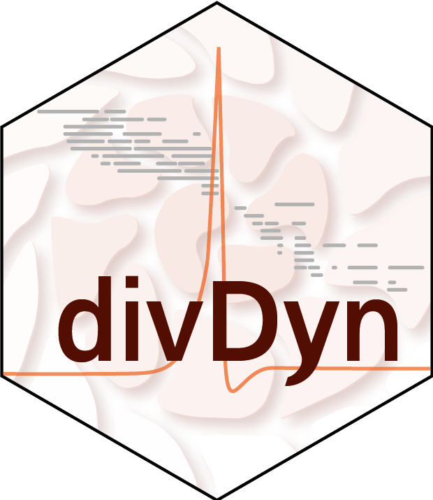
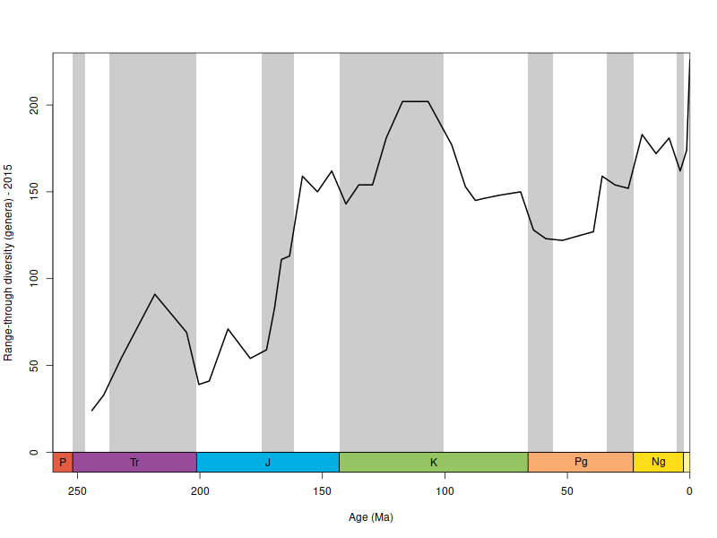

```{r setup, include=FALSE}
knitr::opts_chunk$set(echo = TRUE)

library(badger)
```

# divDyn: Diversity Dynamics 

`r badge_devel("divDyn/r-package", "green")`
`r badge_cran_release("divDyn", "blue")`
`r badge_cran_download("divDyn", "grand-total", "yellow")`
`r badge_cran_checks("divDyn")`
`r badger::badge_doi(doi = "10.5281/zenodo.7056783", color = "blue")` 

### Diversity Dynamics using fossil occurrence data  

Functions to describe sampling and diversity dynamics of fossil occurrence datasets (e.g. from the Paleobiology Database). The package includes methods to calculate range- and occurrence-based metrics of taxonomic richness, extinction and origination rates, along with traditional sampling measures. A powerful subsampling tool is also included that implements frequently used sampling standardization methods in a multiple bin-framework. The plotting of time series and the occurrence data can be simplified by the functions incorporated in the package, as well as other calculations, such as environmental affinities and extinction selectivity testing. Details can be found in: [Kocsis, A.T.; Reddin, C.J.; Alroy, J. and Kiessling, W. (2019)](https://besjournals.onlinelibrary.wiley.com/doi/10.1111/2041-210X.13161).

<br>


## Site Contents  
* * *

The site is getting filled with the following content:

#### Tutorials with the PBDB coral data from 2015

- This particular dataset is used to ensure interface stability and consistency.


#### The 'ddPhanero' analysis (from the MiEE paper)
- Execute up-to-date versions 


#### Function reference and technical material 
 

#### Additional material

- How-to guides on combining the package's capabilities with other packages are deposited on the [Evolv-ED blog](https://www.evolv-ed.net/).


<br>


## Example output  
* * *

```{r, divDyn, eval=FALSE}

# attach library
  library(divDyn)

# import example data
  data(corals)
  data(stages)

# calculate metrics of diversity dynamics
   dd <- divDyn(corals, tax="genus", bin="stg")

# plotting
  tsplot(stages, shading="series", boxes="sys", xlim=c(260,0), 
    ylab="Range-through diversity (genera) - 2015", ylim=c(0,230),
	boxes.col="systemCol")
  lines(stages$mid, dd$divRT, lwd=2)
```


```{r, divDyn_real, include=FALSE}

library(divDyn)

# import data
  data(corals)
  data(stages)

# calculate metrics of diversity dynamics
   dd <- divDyn(corals, tax="genus", bin="stg")

# plotting
png("man/figures/divDyn_example.png", width=800,height=600)
  tsplot(stages, shading="series", boxes="sys", xlim=c(260,0), 
    ylab="Range-through diversity (genera) - 2015", ylim=c(0,230),
	boxes.col="systemCol")
  lines(stages$mid, dd$divRT, lwd=2)
dev.off()


```




<br>

## Plans  
* * *

#### Near

- Splitting up vignettes to separate **Tutorials**
- Adding the ddPhanero case study with updates
- Package updates 

#### Distant

- Writing a C++ library from the core functionality and porting it to Python and Julia


